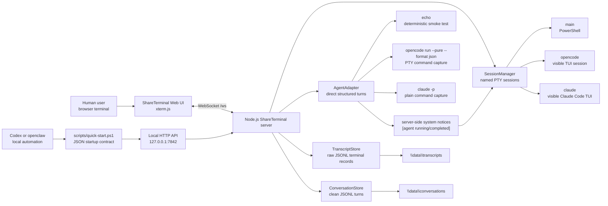

# ShareTerminal

ShareTerminal is a local-first shared terminal bridge for Codex App and other
local agents that need to operate command-line tools together with a human user.
It was built around two practical limits in the usual agent-to-CLI workflow:

1. When an agent runs a command-line tool in its private shell, the user cannot
   see the live session, type into it, interrupt it, or help recover it.
2. When an agent calls interactive CLIs such as `opencode` or `claude` as
   one-off commands, it is difficult to keep a long, resumable conversation with
   the same CLI process or session state.

ShareTerminal turns those private one-shot command executions into shared local
sessions. A human user, Codex, openclaw, opencode, Claude Code, or another local
agent can attach to the same terminal surface, see the same transcript, and send
input through either the browser UI or a local HTTP API.

The browser terminal remains the primary shared workspace: the user can keep
typing while Codex-driven work is visible. For cleaner agent-to-agent turns,
ShareTerminal also exposes a structured direct conversation API. When Codex
starts a direct agent turn in the background, the server publishes compact
`[agent running]` and `[agent completed]` system notices into the same terminal
session transcript, so the visible workspace and the structured history stay in
sync.

## Use Cases

- Let a user watch, interrupt, and continue a CLI session that Codex or another
  agent started.
- Let Codex call local `opencode` and `claude` CLIs without losing conversation
  continuity on every turn.
- Let a local agent inject input into a visible `PowerShell`, `opencode`, or
  `Claude Code` TUI session.
- Keep raw terminal transcripts and clean prompt/reply histories on disk.
- Give external agents such as openclaw one idempotent startup command and a
  stable machine-readable API contract.

## Highlights

- Local-only by default: binds to `127.0.0.1`.
- Browser UI powered by `xterm.js`.
- Real Windows PTY sessions powered by `node-pty`.
- WebSocket streaming for visible terminal I/O.
- Authenticated HTTP API for terminal input.
- Direct JSON conversation API for `echo`, `opencode`, and `claude`.
- Phase 2 team APIs for agent inboxes, task claim, heartbeat, result/failure
  submission, retry, and stale recovery.
- Server-side system notices for direct-agent `running` and `completed` states.
- Persistent JSONL logs under the project-local `data` directory.
- Project-local cache/temp layout for machines where global temp/cache writes
  should be avoided.
- Idempotent `scripts\quick-start.ps1` for other local agents.

## Project Goal

Build a local-only shared terminal service that:

- opens in a browser at `http://127.0.0.1:7842`;
- runs a named PowerShell session through `node-pty`;
- streams terminal output into an `xterm.js` browser terminal;
- accepts user input from the browser;
- accepts Codex or other local agent input through an authenticated HTTP API;
- shows background direct-agent progress as server-side system records inside
  the same terminal transcript;
- automatically reconnects the browser terminal after a local server restart;
- records a persistent transcript under `<repo>\data\transcripts`;
- records clean direct conversation turns under `<repo>\data\conversations`;
- keeps runtime files, logs, and npm cache inside the project by default.

The terminal side defines selectable CLI profiles for `main`, `opencode`, and
`claude`, so the browser or API can create and attach to those named PTY
sessions. The direct conversation API defines `echo`, `opencode`, and `claude`
agent profiles separately from the raw terminal profiles.

Phase 2 planning is tracked in
[`docs\phase2\agent-team-plan.md`](docs/phase2/agent-team-plan.md).

## Architecture

```text
Browser UI
  xterm.js terminal
  optional direct conversation panel
  WebSocket input/output
  JSON conversation API
        |
        v
Node local server on 127.0.0.1:7842
  HTTP API for transcript and terminal input
  HTTP API for direct agent turns
  WebSocket bridge for browser clients
  server-side direct-agent system notices
  SessionManager with CLI profiles
  ConversationStore and AgentAdapter
        |
        v
node-pty Windows ConPTY process
  powershell.exe

Direct agent command mode
  opencode run --pure --format json through PTY-command capture
  claude -p
```

## System Framework



## How Agents Should Use It

For external local agents, start with the quick-start script:

```powershell
$share = .\scripts\quick-start.ps1 | ConvertFrom-Json
```

The returned JSON includes:

- `baseUrl`: local service URL;
- `token`: bearer token for write APIs;
- `endpoints`: stable endpoint templates;
- `sessions`: visible terminal sessions;
- `agents`: direct structured agents;
- `teamAgentInbox`, `teamTaskClaim`, `teamTaskHeartbeat`,
  `teamTaskNeedsUser`, `teamTaskResume`, `teamTaskComplete`, `teamTaskFail`,
  and `teamTaskRecoverStale`: Phase 2 team work endpoints for external agents;
- `storage`: transcript and conversation paths.

Use the direct API for clean prompt/reply turns:

```powershell
$body = @{
  conversationId = 'agent-smoke'
  prompt = 'Reply exactly: OK'
  terminalSession = 'main'
} | ConvertTo-Json

Invoke-RestMethod `
  -Method Post `
  -Uri "$($share.baseUrl)/api/agents/echo/turns" `
  -Headers @{ Authorization = "Bearer $($share.token)" } `
  -ContentType 'application/json' `
  -Body $body
```

Use the raw session API only when controlling a visible terminal or TUI:

```powershell
$body = @{ input = "Reply exactly: CLAUDE_TUI_OK`r" } | ConvertTo-Json

Invoke-RestMethod `
  -Method Post `
  -Uri "$($share.baseUrl)/api/sessions/claude/input" `
  -Headers @{ Authorization = "Bearer $($share.token)" } `
  -ContentType 'application/json' `
  -Body $body
```

Full agent integration details are in
[`docs\agent-integration\startup.md`](docs/agent-integration/startup.md).

## Local Safety Model

- The server binds to `127.0.0.1` by default.
- API writes require a token. If `SHARETERMINAL_TOKEN` is not set,
  `scripts\start.ps1` and `scripts\quick-start.ps1` generate a local token and
  store it under `<repo>\.tmp\shareterminal-token.txt`.
- Transcripts are stored locally in `<repo>\data\transcripts`.
- Conversation turns are stored locally in `<repo>\data\conversations`.
- Runtime temp files are directed to `<repo>\.tmp` by `scripts\start.ps1`.
- npm cache is directed to `<repo>\npm-cache` by `scripts\setup.ps1`.
- Direct agent executable paths default to `opencode` and `claude` on `PATH`.
  They can be overridden with `SHARETERMINAL_OPENCODE_COMMAND`,
  `SHARETERMINAL_CLAUDE_COMMAND`, or `SHARETERMINAL_NPM_GLOBAL_DIR`.
- Optional project-local agent registry overrides can be stored in
  `<repo>\.shareterminal\agents.json`.

Do not expose this service to a LAN or the public internet without adding
stronger access controls.

## Commands

Clone and enter the repository:

```powershell
git clone https://github.com/Drew593990/codex-shared-Terminal.git
Set-Location .\codex-shared-Terminal
```

Install dependencies with the project-local npm cache:

```powershell
Set-Location <repo>
.\scripts\setup.ps1
```

Run tests:

```powershell
Set-Location <repo>
npm test
```

Run syntax checks:

```powershell
Set-Location <repo>
npm run check
```

Start the local server:

```powershell
Set-Location <repo>
.\scripts\start.ps1
```

Idempotent quick start for other local agents:

```powershell
Set-Location <repo>
.\scripts\quick-start.ps1
```

The quick-start script reuses an existing server when possible, starts one when
needed, waits for the API, and prints JSON containing `baseUrl`, `token`,
endpoint URLs, storage paths, and examples. See
`docs\agent-integration\startup.md` for the full contract.

Open:

```text
http://127.0.0.1:7842
```

## Local API

For write calls, get the local token from the quick-start contract first:

```powershell
$share = .\scripts\quick-start.ps1 | ConvertFrom-Json
```

List CLI profiles:

```powershell
Invoke-RestMethod http://127.0.0.1:7842/api/profiles
```

List sessions:

```powershell
Invoke-RestMethod http://127.0.0.1:7842/api/sessions
```

Read raw transcript:

```powershell
Invoke-RestMethod http://127.0.0.1:7842/api/sessions/main/transcript
```

Send raw terminal input:

```powershell
Invoke-RestMethod `
  -Method Post `
  -Uri http://127.0.0.1:7842/api/sessions/main/input `
  -Headers @{ Authorization = "Bearer $($share.token)" } `
  -ContentType "application/json" `
  -Body '{"input":"Write-Output \"hello from API\"\r"}'
```

List direct agents:

```powershell
Invoke-RestMethod http://127.0.0.1:7842/api/agents
```

Create a structured direct turn:

```powershell
Invoke-RestMethod `
  -Method Post `
  -Uri http://127.0.0.1:7842/api/agents/echo/turns `
  -Headers @{ Authorization = "Bearer $($share.token)" } `
  -ContentType "application/json" `
  -Body '{"conversationId":"direct-main","prompt":"Reply exactly: DIRECT_OK"}'
```

Read clean conversation history:

```powershell
Invoke-RestMethod http://127.0.0.1:7842/api/conversations/direct-main/turns
```

For Codex-side use, prefer `/api/agents/:agent/turns` and
`/api/conversations/:id/turns` over `/api/sessions/:name/transcript` when the
goal is to have a readable conversation with `opencode` or `claude`. The server
stores a `running` turn before the agent process starts and updates the same
turn to `completed` or `failed` when it exits, so browser clients can show
progress while preserving one conversation history. The same lifecycle also
publishes compact system records to the selected terminal session, `main` by
default. Browser-originated direct prompts include the current terminal session
so the visible xterm receives the status notices.

`opencode` uses a PTY-backed non-interactive command because its `run` command
needs a TTY on this Windows setup. The API still returns clean structured turns;
it does not depend on screenshots or visual screen parsing.

## Validation

The current test suite covers the transcript store, session manager, web server
routes, direct conversation store, agent adapter, opencode JSON parsing, and
server-side running/completed system notices.

```powershell
npm run check
npm test
```

Real local smoke tests have verified:

- raw PowerShell input through `/api/sessions/main/input`;
- visible Claude Code TUI input through `/api/sessions/claude/input`;
- direct `echo` turns;
- direct `opencode` turns and `--session` continuation;
- direct `claude` turns;
- browser-visible running/completed notices in the same terminal.

## License

MIT. See [LICENSE](LICENSE).

## Project Layout

```text
shareterminal
|-- README.md
|-- LICENSE
|-- package.json
|-- docs\
|   `-- agent-integration\
|-- public\
|   |-- app.js
|   |-- index.html
|   `-- style.css
|-- scripts\
|   |-- quick-start.ps1
|   |-- setup.ps1
|   `-- start.ps1
|-- server\
|   |-- agent-adapter.js
|   |-- config.js
|   |-- conversation-store.js
|   |-- index.js
|   |-- session-manager.js
|   |-- transcript-store.js
|   `-- web-server.js
`-- test\
    |-- agent-adapter.test.js
    |-- config.test.js
    |-- conversation-store.test.js
    |-- session-manager.test.js
    |-- transcript-store.test.js
    `-- web-server.test.js
```
