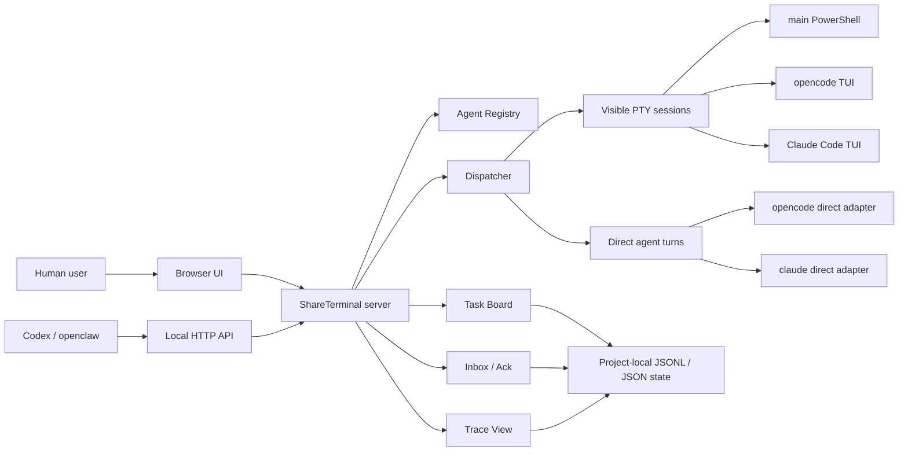

# Phase 2: Agent Team Layer

This document records the target, design direction, and implementation approach
for ShareTerminal phase 2.

## Background

Phase 1 proved the core shared-terminal bridge:

- a user and Codex can observe the same browser terminal;
- Codex or another local agent can inject input through a local API;
- direct calls to local CLIs such as `opencode` and `claude` can return clean
  structured turns;
- direct-agent running/completed notices appear in the visible terminal stream.

Phase 2 should build on that foundation. The goal is not to turn ShareTerminal
into a generic AI framework. The goal is to make local CLI agents cooperate as a
visible, resumable, user-controllable team.

## Problem Statement

Codex App and similar agents have two practical limits when they call local CLI
tools:

1. If the agent runs a CLI in a private shell, the user cannot see the live
   session, type into it, interrupt it, or help recover it.
2. If the agent repeatedly launches CLIs such as `opencode` or `claude` as
   one-off commands, long conversations and session state are easy to lose.

Phase 2 should solve the next layer above this: once sessions are visible and
controllable, multiple agents need a shared task model, durable state, routing,
result handoff, and recovery.

## Reference Research

The closest reference project found so far is
[`SeemSeam/claude_codex_bridge`](https://github.com/SeemSeam/claude_codex_bridge),
also called CCB.

Relevant CCB ideas:

- project anchor: a project-level directory defines the control boundary;
- daemon-owned state: terminal panes are execution resources, not the authority;
- dispatcher: user requests become queued jobs with lifecycle records;
- message lineage: submissions, messages, attempts, jobs, and replies are
  traceable;
- mailbox/inbox/ack: replies are delivered as durable events, not only printed;
- provider-specific runtime: Codex, Claude, Gemini, and OpenCode each have their
  own launch and completion logic;
- per-agent worktrees: agents can work in isolated git workspaces;
- role packs: specialized agents can carry instructions, memory, tools, and
  provider configuration.

Important constraints:

- CCB is AGPL-3.0-only, so ShareTerminal must not copy or embed its code while
  remaining MIT.
- CCB is Linux/macOS/WSL-oriented and tmux-based. ShareTerminal is
  Windows/browser/node-pty-oriented.
- CCB is a large full platform. ShareTerminal should implement a smaller,
  incremental subset that matches the existing architecture.

## Phase 2 Target

Build a lightweight Agent Team Layer for ShareTerminal.

The layer should allow a human user, Codex, openclaw, `opencode`, `claude`, and
future local agents to:

- register available agents and their capabilities;
- create tasks with durable ids and status;
- assign tasks to visible terminal sessions or direct agents;
- keep task progress and result history across restarts;
- show agent/team state in the browser UI;
- let the user intervene before, during, or after agent work;
- route completed results into a readable inbox instead of losing them in raw
  terminal output;
- retry, cancel, or continue tasks with traceable state.

## Non-Goals

Do not implement these in the first Phase 2 slice:

- a full CCB clone;
- tmux integration;
- AGPL-derived code;
- cloud orchestration;
- a general SaaS multi-agent platform;
- support for every CLI provider;
- automatic autonomous agent loops without user-visible control.

## Proposed Architecture



## Components

### Agent Registry

Purpose: define which agents exist and how they can be used.

Initial fields:

- `name`: stable id such as `codex`, `opencode`, `claude`, `openclaw`;
- `label`: UI display name;
- `kind`: `terminal`, `direct`, or `external`;
- `session`: visible terminal session name when applicable;
- `directAgent`: direct API agent name when applicable;
- `capabilities`: examples include `code`, `review`, `research`, `shell`,
  `long-conversation`;
- `worktreeMode`: `shared`, `isolated`, or `none`;
- `enabled`: whether the agent is active.

Storage:

- default built-in registry in code;
- optional project override in `<repo>\.shareterminal\agents.json` later.

### Task Board

Purpose: durable task state.

Initial task lifecycle:

- `created`;
- `queued`;
- `running`;
- `needs_user`;
- `completed`;
- `failed`;
- `cancelled`.

Initial fields:

- `taskId`;
- `title`;
- `prompt`;
- `createdBy`;
- `assignedTo`;
- `status`;
- `conversationId`;
- `terminalSession`;
- `createdAt`;
- `updatedAt`;
- `result`;
- `error`;
- `parentTaskId`;
- `attempts`.

Storage:

- append-only JSONL event log for auditability;
- materialized JSON summary for fast UI reads.

### Dispatcher

Purpose: convert tasks into execution.

Execution modes:

- visible terminal input through `/api/sessions/:name/input`;
- direct structured turn through `/api/agents/:agent/turns`;
- future external connector call.

Rules:

- one running task per agent by default;
- queue additional work per agent;
- publish lifecycle notices into the visible terminal session;
- write every state transition to the task event log;
- never silently consume a result without recording it.

### Inbox / Ack

Purpose: make results actionable.

Instead of only writing a reply into a transcript, completed tasks should produce
an inbox item for the requester or user.

Initial operations:

- list inbox items;
- read item detail;
- ack item;
- retry failed item;
- continue from item into a new task.

### Trace

Purpose: reconstruct task context from any id.

Given a `taskId`, `conversationId`, `turnId`, or inbox item id, Trace should show:

- original request;
- assigned agent;
- execution path;
- visible session;
- direct turn id if any;
- status history;
- result or error;
- child tasks and parent task if applicable.

### Provider Adapters

Purpose: keep CLI-specific logic out of dispatcher.

Initial adapters:

- `echo`: deterministic smoke-test adapter;
- `opencode`: direct command adapter plus visible session profile;
- `claude`: direct command adapter plus visible session profile.

Design rule:

- each provider owns its own completion and reply extraction logic;
- do not use one shared string parser for every CLI;
- keep provider adapter outputs normalized into task/result records.

### Optional Worktree Support

Purpose: let agents work without corrupting the main checkout.

Initial approach:

- keep off by default;
- allow per-agent `worktreeMode = isolated`;
- create worktrees under project-local `.worktrees`;
- record branch/worktree path in task state;
- expose cleanup commands only after status is terminal.

## API Sketch

Read-only:

```text
GET /api/team/agents
GET /api/team/tasks
GET /api/team/tasks/:taskId
GET /api/team/inbox
GET /api/team/trace/:id
```

Write:

```text
POST /api/team/tasks
POST /api/team/tasks/:taskId/cancel
POST /api/team/tasks/:taskId/retry
POST /api/team/inbox/:itemId/ack
```

Example task submission:

```json
{
  "title": "Review parser changes",
  "prompt": "Review the latest parser changes and list blocking issues.",
  "assignedTo": "opencode",
  "mode": "direct",
  "terminalSession": "main"
}
```

## Browser UI Direction

Keep the terminal as the primary surface. Add a compact team panel rather than a
separate large platform.

Suggested panel sections:

- Agents: name, kind, busy/idle/error, active task;
- Task Board: queued/running/completed/failed tasks;
- Inbox: results waiting for user/Codex acknowledgement;
- Trace detail: selected task timeline.

Important UI rule:

- Codex-driven work must be visible without stealing terminal focus from the
  user.

## Implementation Slices

### Slice 1: Durable Task Board

- Add task store and tests.
- Add task CRUD/read APIs.
- Add deterministic `echo` execution path.
- Show task status in a basic browser panel.

### Slice 2: Dispatcher to Existing Direct API

- Route tasks to existing `/api/agents/:agent/turns`.
- Publish task running/completed notices to visible terminal session.
- Store task attempts and result.
- Add retry/cancel where safe.

### Slice 3: Inbox and Trace

- Create inbox item on terminal task completion.
- Add ack and detail APIs.
- Add trace endpoint for task and turn ids.
- Add UI views for inbox and trace.

### Slice 4: Agent Registry and Config

- Add built-in registry.
- Add optional project-local `.shareterminal\agents.json`.
- Validate unknown agents and disabled agents.
- Surface capabilities in UI/API.

### Slice 5: Optional Worktree Mode

- Add per-agent isolated worktree support.
- Add status and cleanup.
- Keep disabled by default until stable.

## Validation Requirements

Each slice should include:

- unit tests for stores and state transitions;
- route tests for every API;
- one local smoke test through `scripts\quick-start.ps1`;
- browser verification for visible panel updates when UI changes;
- a security scan for accidental local paths or tokens before publishing.

## Open Questions

- Should task board state live under `data/team` or `.shareterminal/team`?
- Should project configuration be public-by-default or ignored-by-default?
- Should direct `opencode` continuation use ShareTerminal conversation ids,
  native CLI session ids, or both?
- Should user approval be a task state (`needs_user`) or an inbox item type?
- How should external agents such as openclaw discover the team API contract?

## Near-Term Recommendation

Start with Slice 1 and Slice 2 only.

This keeps the implementation close to the stable Phase 1 architecture while
creating the durable model needed for later multi-agent cooperation. Avoid
copying CCB internals. Use CCB as an architectural reference for boundaries:
project anchor, dispatcher, message lineage, provider adapters, inbox, and
trace.
