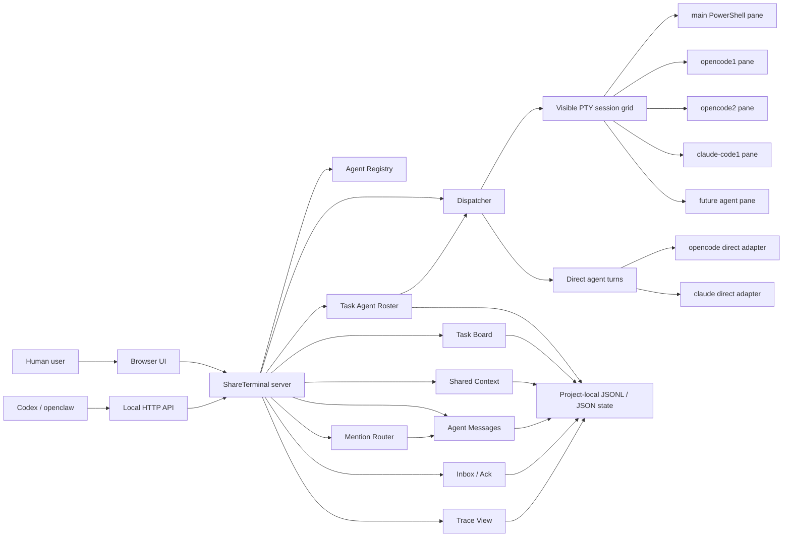

# Phase 2: Agent Team Layer

This document records the target, design direction, and implementation approach
for ShareTerminal phase 2.

## Background

Phase 1 proved the core shared-terminal bridge:

- a user and Codex can observe the same browser terminal;
- Codex or another local agent can inject input through a local API;
- direct calls to local CLIs such as `opencode` and `claude` can return clean
  structured turns;
- direct-agent running/completed notices appear in the visible terminal stream.

Phase 2 should build on that foundation. The goal is not to turn ShareTerminal
into a generic AI framework. The goal is to make local CLI agents cooperate as a
visible, resumable, user-controllable team.

The phase boundary is:

- Phase 1: one visible terminal surface can be jointly controlled by the user
  and Codex, but the active terminal view normally contains one working CLI at a
  time, such as `opencode` or `claude`.
- Phase 2: one visible ShareTerminal workspace can contain multiple live agents
  as a team. They can see shared project context, current commands, runtime
  environment, and work progress; they can talk to each other, split work,
  execute different tasks, and remain visible while a backend communication
  system handles dispatch, collection, tracing, and recovery.

## Problem Statement

Codex App and similar agents have two practical limits when they call local CLI
tools:

1. If the agent runs a CLI in a private shell, the user cannot see the live
   session, type into it, interrupt it, or help recover it.
2. If the agent repeatedly launches CLIs such as `opencode` or `claude` as
   one-off commands, long conversations and session state are easy to lose.

Phase 2 should solve the next layer above this: once one CLI session is visible
and controllable, multiple live CLI agents need a shared workspace model,
durable task state, shared context, inter-agent messaging, task routing, result
handoff, tracing, and recovery.

## Reference Research

The closest reference project found so far is
[`SeemSeam/claude_codex_bridge`](https://github.com/SeemSeam/claude_codex_bridge),
also called CCB.

Relevant CCB ideas:

- project anchor: a project-level directory defines the control boundary;
- daemon-owned state: terminal panes are execution resources, not the authority;
- dispatcher: user requests become queued jobs with lifecycle records;
- message lineage: submissions, messages, attempts, jobs, and replies are
  traceable;
- mailbox/inbox/ack: replies are delivered as durable events, not only printed;
- provider-specific runtime: Codex, Claude, Gemini, and OpenCode each have their
  own launch and completion logic;
- per-agent worktrees: agents can work in isolated git workspaces;
- role packs: specialized agents can carry instructions, memory, tools, and
  provider configuration.

Important constraints:

- CCB is AGPL-3.0-only, so ShareTerminal must not copy or embed its code while
  remaining MIT.
- CCB is Linux/macOS/WSL-oriented and tmux-based. ShareTerminal is
  Windows/browser/node-pty-oriented.
- CCB is a large full platform. ShareTerminal should implement a smaller,
  incremental subset that matches the existing architecture.

## Phase 2 Target

Build a lightweight Agent Team Layer for ShareTerminal.

The layer should allow a human user, Codex, openclaw, `opencode`, `claude`, and
future local agents to:

- appear together in one browser workspace instead of replacing each other in a
  single terminal view;
- add or remove repeatable agent instances during a task, such as three
  `opencode` agents and two `claude` agents in the same workspace;
- add other local CLI profiles later and instantiate them into the same task
  workspace;
- register available agents and their capabilities;
- create tasks with durable ids and status;
- assign tasks to visible terminal sessions or direct agents;
- address specific agents with mentions such as `@opencode1`, `@opencode2`,
  `@claude-code1`, or `@codex1`;
- let mentioned agents join a team conversation, negotiate work, split
  assignments, and return a final combined delivery;
- read shared context about the current command, environment, repository state,
  task board, and progress;
- exchange messages with each other through a backend communication channel;
- split a larger request into separate agent-owned tasks that can run in
  parallel;
- show a task subview with the current roster, each agent's state, active work,
  and latest handoff;
- treat the first agent in the task roster as the default leader unless the user
  chooses another leader;
- let the leader agent plan, delegate, inspect returned work, request fixes, and
  prepare the final delivery after checks pass;
- keep task progress and result history across restarts;
- show agent/team state in the browser UI;
- let the user intervene before, during, or after agent work;
- route completed results into a readable inbox instead of losing them in raw
  terminal output;
- retry, cancel, or continue tasks with traceable state.

## Non-Goals

Do not implement these in the first Phase 2 slice:

- a full CCB clone;
- tmux integration;
- AGPL-derived code;
- cloud orchestration;
- a general SaaS multi-agent platform;
- support for every CLI provider;
- automatic autonomous agent loops without user-visible control;
- hidden background agents that the user cannot inspect or interrupt.

## Proposed Architecture



## Components

### Agent Registry

Purpose: define which agent profiles exist and how new instances can be
created.

Initial fields:

- `profileId`: stable provider/profile id such as `codex`, `opencode`,
  `claude`, `openclaw`;
- `label`: UI display name;
- `command`: default CLI command or direct adapter id;
- `kind`: `terminal`, `direct`, or `external`;
- `directAgent`: direct API agent name when applicable;
- `capabilities`: examples include `code`, `review`, `research`, `shell`,
  `long-conversation`;
- `worktreeMode`: `shared`, `isolated`, or `none`;
- `defaultCount`: optional number of instances to create when a task starts;
- `enabled`: whether the agent is active.

Storage:

- default built-in registry in code;
- optional project override in `<repo>\.shareterminal\agents.json`.

Rules:

- built-in profiles cover known CLIs such as `opencode`, `claude`, and `codex`;
- custom profiles can be added for other local CLIs by defining command,
  working directory behavior, environment policy, and adapter type;
- adding a profile does not automatically add it to a task; the roster controls
  which instances are actually participating;
- disabling a profile should not delete historical roster entries or traces.

### Task Agent Roster

Purpose: define which agent instances are participating in the current task or
team workspace.

The roster is separate from the registry. The registry says which profiles are
available. The roster says which concrete instances are in this task.

Example roster:

```json
[
  { "agentId": "opencode1", "profileId": "opencode", "role": "leader" },
  { "agentId": "opencode2", "profileId": "opencode", "role": "worker" },
  { "agentId": "opencode3", "profileId": "opencode", "role": "worker" },
  { "agentId": "claude-code1", "profileId": "claude", "role": "reviewer" },
  { "agentId": "claude-code2", "profileId": "claude", "role": "worker" }
]
```

Initial roster fields:

- `agentId`: unique mentionable id within the task, such as `opencode1`;
- `profileId`: registry profile used to create the instance;
- `role`: `leader`, `worker`, `reviewer`, `observer`, or future custom role;
- `session`: visible terminal session name when applicable;
- `conversationId`: direct conversation id when applicable;
- `status`: `idle`, `planning`, `running`, `waiting`, `reviewing`, `blocked`,
  `completed`, `failed`, or `removed`;
- `activeTaskId`: current child task id if any;
- `lastActivityAt`;
- `addedBy`;
- `removedAt`.

Rules:

- users and Codex can add more instances of the same profile at any time;
- users and Codex can remove idle or completed instances at any time;
- removing a running instance should require cancel, detach, or handoff first;
- instance ids are stable within a task, so `@opencode1` always targets the
  same agent unless it has been removed;
- the first agent in the roster is the default leader unless the user selects a
  different leader;
- the leader can be reassigned, but the reassignment must be recorded in trace.

### Mention Router

Purpose: convert human-readable `@agent` calls into team messages and task
assignments.

Mention examples:

- `@opencode1 inspect the server routes`;
- `@opencode2 write tests for the task store`;
- `@claude-code1 review opencode1's result`;
- `@codex1 summarize the final delivery`.

Routing rules:

- `@agentId` targets one roster instance;
- `@profileId` currently resolves to an existing idle roster instance with that
  profile, preferring a non-leader worker when available;
- `@team` targets the whole roster;
- `@leader` targets the current leader;
- mentions should be stored as structured messages, not only injected into the
  terminal as text;
- mention parsing must preserve the original user text in the trace;
- profile mention routing is stored as `mentionRoutes`, so `@opencode` can
  remain visible in the prompt while dispatch, inbox, and claim use a concrete
  agent id such as `opencode2`.

### Leader Agent

Purpose: coordinate the team without hiding the work from the user.

Default behavior:

- the first roster agent is the leader by default;
- the task subview should visually mark the leader;
- the leader receives the original user request and current shared context;
- the leader creates the initial plan and child-task split;
- the leader assigns tasks through the dispatcher or asks the user before
  dispatch when approval is required;
- the leader reads returned results, checks them against the request, requests
  fixes if needed, and only then prepares the final delivery;
- the final delivery should include which agents contributed and what evidence
  was checked.

The leader is a coordination role, not an invisible privileged process. Its
terminal/direct conversation should remain inspectable like every other agent.

### Task Board

Purpose: durable task state.

Initial task lifecycle:

- `created`;
- `queued`;
- `running`;
- `needs_user`;
- `completed`;
- `failed`;
- `cancelled`.

Initial fields:

- `taskId`;
- `title`;
- `prompt`;
- `createdBy`;
- `assignedTo`: one agent id, multiple agent ids, `@team`, or `@leader`;
- `leaderAgentId`;
- `rosterId`;
- `status`;
- `conversationId`;
- `terminalSession`;
- `createdAt`;
- `updatedAt`;
- `result`;
- `error`;
- `parentTaskId`;
- `childTaskIds`;
- `handoffFrom`;
- `handoffTo`;
- `reviewedBy`;
- `reviewStatus`;
- `userRequest`;
- `userResponse`;
- `attempts`.

Storage:

- append-only JSONL event log for auditability;
- materialized JSON summary for fast UI reads.

### Shared Context

Purpose: give every agent a common view of the current workspace without forcing
them to scrape the terminal screen.

Initial context fields:

- active project root;
- current terminal sessions and their last known commands;
- environment summary relevant to local CLIs;
- git branch/status summary;
- current team roster and leader;
- active tasks and assigned agents;
- recent completed results;
- user-visible notes or constraints.

Design rule:

- shared context is a server-maintained projection, not an uncontrolled copy of
  raw terminal scrollback;
- agents should use structured context first, and raw transcripts only when
  they need exact terminal evidence.

Current implementation:

- `context.workspace` exposes the server project root and cwd;
- `context.runtime` exposes platform, shell, and process id;
- `context.git` exposes branch, short commit, dirty state, and changed files
  when the workspace is a git checkout;
- `context.terminalSessions` exposes initialized visible terminal sessions and
  their command/cwd/client metadata;
- if git cannot be read, `context.git.available` is `false` and includes an
  error message.

### Agent Messages

Purpose: let agents communicate without abusing terminal input as the only
transport.

Initial message fields:

- `messageId`;
- `from`;
- `to`;
- `mentions`;
- `taskId`;
- `body`;
- `status`;
- `createdAt`;
- `readAt`;
- `replyTo`.

Initial operations:

- send message to an agent;
- send message to `@team` or `@leader`;
- list pending messages for an agent;
- mark message read;
- link message to task trace.

This is the lightweight equivalent of a mailbox. It should support agent-agent
coordination while still surfacing important events to the user.

### Dispatcher

Purpose: convert tasks into execution.

Execution modes:

- visible terminal input through `/api/sessions/:name/input`;
- direct structured turn through `/api/agents/:agent/turns`;
- future external connector call.

Rules:

- one running task per agent by default;
- queue additional work per agent;
- allow multiple agents to run in parallel when they own separate sessions or
  workspaces;
- when a task targets `@team`, route the first planning turn to the leader;
- after the leader produces a plan, create child tasks for selected agents;
- route returned worker results back to the leader for review before final
  delivery;
- publish lifecycle notices into the visible terminal session;
- write every state transition to the task event log;
- never silently consume a result without recording it.

### Inbox / Ack

Purpose: make results actionable.

Instead of only writing a reply into a transcript, completed tasks should produce
an inbox item for the requester or user.

Initial operations:

- list inbox items;
- read item detail;
- ack item;
- retry failed item;
- continue from item into a new task.

### Trace

Purpose: reconstruct task context from any id.

Given a `taskId`, `messageId`, `conversationId`, `turnId`, or inbox item id,
Trace should show:

- original request;
- assigned agent;
- execution path;
- visible session;
- direct turn id if any;
- status history;
- result or error;
- child tasks and parent task if applicable.

Current implementation:

- `GET /api/team/trace/:id` accepts a task id, message id, or inbox item id;
- message and inbox identifiers resolve back to their owning task when they
  carry a `taskId`;
- trace responses include the resolved `task`, related `tasks`, timeline
  `events`, and optional `message` or `inboxItem` fields when the lookup id was
  one of those records.

### Provider Adapters

Purpose: keep CLI-specific logic out of dispatcher.

Initial adapters:

- `echo`: deterministic smoke-test adapter;
- `opencode`: direct command adapter plus visible session profile;
- `claude`: direct command adapter plus visible session profile.

Design rule:

- each provider owns its own completion and reply extraction logic;
- do not use one shared string parser for every CLI;
- keep provider adapter outputs normalized into task/result records.

### Optional Worktree Support

Purpose: let agents work without corrupting the main checkout.

Initial approach:

- keep off by default;
- allow per-agent `worktreeMode = isolated`;
- create worktrees under project-local `.worktrees`;
- record branch/worktree path in task state;
- expose cleanup commands only after status is terminal.

## API Sketch

Read-only:

```text
GET /api/team/agents
GET /api/team/agents/:agentId/inbox
GET /api/team/roster
GET /api/team/tasks
GET /api/team/tasks/:taskId
GET /api/team/context
GET /api/team/messages?agent=:agentId
GET /api/team/inbox
GET /api/team/trace/:id
```

Write:

```text
POST /api/team/tasks
POST /api/team/agents
POST /api/team/roster/agents
POST /api/team/roster/leader
POST /api/team/roster/agents/:agentId/remove
POST /api/team/tasks/:taskId/claim
POST /api/team/tasks/:taskId/heartbeat
POST /api/team/tasks/:taskId/needs-user
POST /api/team/tasks/:taskId/resume
POST /api/team/tasks/:taskId/complete
POST /api/team/tasks/:taskId/fail
POST /api/team/tasks/recover-stale
POST /api/team/tasks/:taskId/cancel
POST /api/team/tasks/:taskId/retry
POST /api/team/context/notes
POST /api/team/messages
POST /api/team/messages/:messageId/read
POST /api/team/inbox/:itemId/ack
```

Example task submission:

```json
{
  "title": "Review and test parser changes",
  "prompt": "@team review the parser changes, split implementation and test work, then produce one checked delivery.",
  "assignedTo": "@team",
  "leaderAgentId": "opencode1",
  "mode": "team",
  "roster": [
    { "profileId": "opencode", "agentId": "opencode1", "role": "leader" },
    { "profileId": "opencode", "agentId": "opencode2", "role": "worker" },
    { "profileId": "claude", "agentId": "claude-code1", "role": "reviewer" }
  ]
}
```

Example adding an agent instance during a running task:

```json
{
  "profileId": "opencode",
  "agentId": "opencode3",
  "role": "worker",
  "reason": "Need a separate agent to inspect browser UI changes."
}
```

## Browser UI Direction

Keep the terminal as the primary surface. Add a compact team panel rather than a
separate large platform.

Suggested panel sections:

- Task Team: current roster, leader marker, add/remove controls, per-agent
  status, active child task, latest message, and last result;
- Agents: available profiles, kind, capabilities, default command, enabled
  state;
- Workspace Grid: multiple visible agent terminal panes in one browser
  workspace;
- Task Board: queued/running/completed/failed tasks;
- Agent Messages: inter-agent messages and handoffs;
- Inbox: results waiting for user/Codex acknowledgement;
- Trace detail: selected task timeline.

Important UI rule:

- Codex-driven work must be visible without stealing terminal focus from the
  user.
- The task subview must show which agents are participating in this task and
  which one is the leader before any team dispatch starts.
- Adding another `opencode` or `claude` instance should create a new roster
  entry and a visible pane/session, not replace the existing one.
- Removing an agent should leave its prior messages, task trace, and terminal
  transcript available for audit.
- The final delivery should be visually tied to the leader's checked summary,
  with worker outputs available underneath it.

## Implementation Slices

### Slice 1: Durable Task Board

- Add task store and tests.
- Add roster store with repeatable agent instances.
- Add task CRUD/read APIs.
- Add roster read/add/remove/set-leader APIs.
- Add deterministic `echo` execution path.
- Show task status and current roster in a basic browser panel.

### Slice 2: Multi-Session Workspace View

- Add browser layout for multiple visible terminal sessions.
- Keep each agent pane attached to its own named PTY session.
- Preserve user focus and input routing per pane.
- Show shared session status without hiding terminal output.
- Add one-click add/remove controls for repeatable provider instances.
- Mark the leader agent in the task subview.

### Slice 3: Mention Router and Leader Planning

- Parse `@agentId`, `@profileId`, `@team`, and `@leader` mentions.
- Persist mentions as structured messages.
- Route the first `@team` turn to the leader.
- Let the leader create child tasks for selected agents.

### Slice 4: Dispatcher to Existing Direct API

- Route tasks to existing `/api/agents/:agent/turns`.
- Publish task running/completed notices to visible terminal session.
- Store task attempts and result.
- Add retry/cancel where safe.
- Return worker results to the leader for review before final delivery.

### Slice 5: Shared Context and Agent Messages

- Add shared context projection.
- Add agent message store and APIs.
- Let an agent read pending messages and linked task context.
- Surface important inter-agent messages in the UI.

### Slice 6: Inbox and Trace

- Create inbox item on terminal task completion.
- Add ack and detail APIs.
- Add trace endpoint for task, message, inbox, and turn ids.
- Add UI views for inbox and trace.
- Trace leader planning, delegation, worker handoffs, review, and final
  delivery.

### Slice 7: Agent Registry and Config

- Add built-in registry.
- Add optional project-local `.shareterminal\agents.json`.
- Validate unknown agents and disabled agents.
- Surface capabilities in UI/API.

### Slice 8: Optional Worktree Mode

- Add per-agent isolated worktree support.
- Add status and cleanup.
- Keep disabled by default until stable.

## Validation Requirements

Each slice should include:

- unit tests for stores and state transitions;
- route tests for every API;
- one local smoke test through `scripts\quick-start.ps1`;
- browser verification for visible panel updates when UI changes;
- a security scan for accidental local paths or tokens before publishing.

## Open Questions

- Should task board state live under `data/team` or `.shareterminal/team`?
- Should project configuration be public-by-default or ignored-by-default?
- Should direct `opencode` continuation use ShareTerminal conversation ids,
  native CLI session ids, or both?
- How much structure should `needs_user` requests require beyond a question,
  reason, and resumed answer?
- How should external agents such as openclaw discover the team API contract?
- Should `@profileId` auto-select an idle instance, create a new instance, or
  ask the user when no exact `@agentId` is provided?
- What is the minimum leader review evidence required before final delivery?
- Should removed agent panes stay visible in a collapsed audit state or move
  only to trace/history?

## Near-Term Recommendation

Start with Slice 1 and Slice 2 only, but design their data model around team
rosters from the beginning.

This creates the missing foundations before deeper automation: durable task
state, repeatable agent instances, add/remove lifecycle, leader marking, and a
browser workspace that can show multiple live agents at once. After those are
stable, add mention routing, leader planning, dispatcher routing, shared
context, agent messages, inbox, and trace. Avoid copying CCB internals. Use CCB
as an architectural reference for boundaries: project anchor, dispatcher,
message lineage, provider adapters, inbox, and trace.
