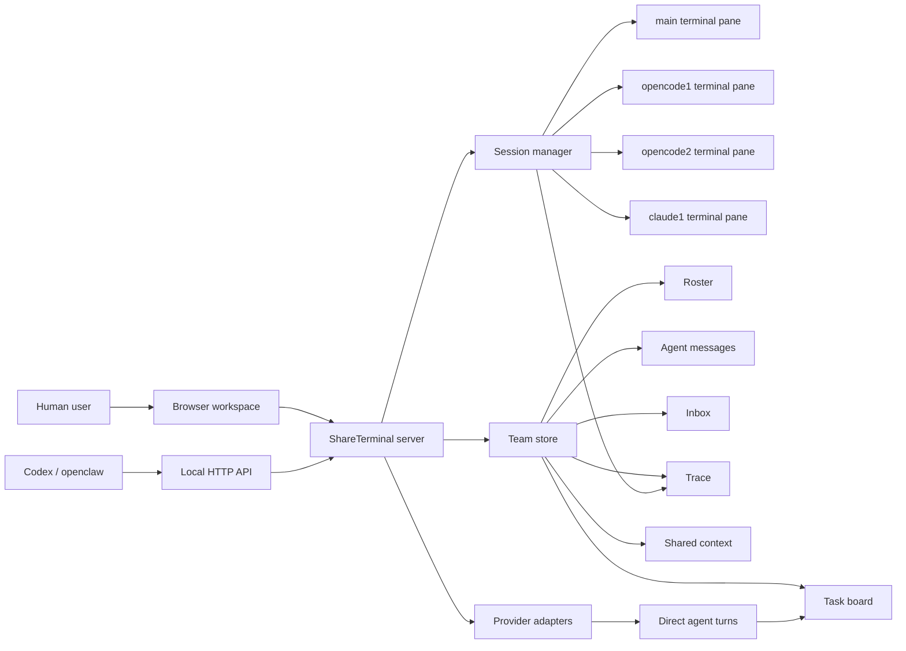

# Agent Team Workspace Design

Date: 2026-06-14

## Superseded UI Direction

The equal multi-terminal grid direction in this spec has been superseded by the
main-terminal-with-agent-cards direction documented in
`docs/phase2/main-terminal-agent-workspace.md`.

The corrected direction is:

- keep one real main xterm terminal as the command and supervision surface;
- place agent child interfaces below the main terminal;
- render child interfaces as structured dialogue/task/result cards by default;
- allow raw CLI output to be expanded inside each card when needed;
- let users add/remove child interfaces and choose which local agent CLI each
  card runs;
- let main-terminal mentions such as `@opencode`, `@claude`, and `@team`
  create or reuse cards and drive backend dispatch.

## Approved Direction

Use one browser workspace with a visible multi-terminal grid.

The phase 2 workspace keeps terminal panes as the primary shared surface. A
human user, Codex, openclaw, opencode, Claude Code, and future local agents can
attach to the same browser workspace, see the same task state, and keep typing
into visible CLI sessions. Team coordination is backed by structured APIs for
tasks, messages, inbox items, trace records, and recovery, but the user's
default experience remains a shared terminal workspace rather than a hidden
background panel.

This design was chosen over:

- a merged terminal timeline, because full-screen TUI tools such as opencode
  and Claude Code need their own real PTY surfaces;
- a tab-only workspace, because it hides concurrent work and weakens the main
  phase 2 goal of multiple visible agents working together.

## Goals

- Show multiple live agent terminals in one browser workspace.
- Let the user and Codex both input into any visible agent session.
- Keep the current `main` terminal visible as the shared command surface.
- Add repeatable agent instances such as `opencode1`, `opencode2`, and
  `claude1` without replacing an existing pane.
- Make roster, role, workspace mode, active task, and recent lifecycle state
  visible on each agent pane.
- Route `@team`, `@leader`, `@agentId`, and `@profileId` tasks through durable
  backend state.
- Let worker agents run concurrently when they own separate sessions or direct
  conversations.
- Return worker results to the leader for review and final delivery.
- Publish task lifecycle, failures, needs-user pauses, resume events, and
  recovered work into visible terminal panes and trace records.
- Preserve inbox and trace history across server restarts.

## Non-Goals

- Do not clone the CCB/tmux architecture.
- Do not add cloud orchestration.
- Do not create a general SaaS multi-agent platform.
- Do not hide autonomous agents from the user.
- Do not require all providers to support the same direct-output parser.
- Do not replace xterm panes with a synthetic transcript-only view.

## Existing Foundation

The current phase 2 branch already has the core backend and partial UI
foundation:

- `public/app.js` keeps a `terminalPanes` map and can `connectPane()` for named
  sessions.
- `public/style.css` already lays terminal panes out as an xterm grid.
- `/api/team/roster` creates visible sessions for active roster agents through
  `SessionManager.getOrCreateWithProfile()`.
- `/api/team/tasks`, `/api/team/messages`, `/api/team/inbox`, and
  `/api/team/trace/:id` provide durable coordination surfaces.
- `@team` dispatch can split work to mentioned workers concurrently, then hand
  worker results to the leader.
- Failed split workers fail the parent task and create retryable inbox items.
- External agents can claim, heartbeat, complete, fail, pause, resume, and
  recover stale tasks.
- Per-agent workspace plans and optional isolated git worktrees are already
  represented in roster state.

The next work should unify these pieces into one coherent user-facing team
workspace.

## Architecture

The browser workspace is the operator surface. The server owns durable team
state. PTY sessions are execution and observation resources. Direct turns are
provider-specific execution resources. The team store links all of them through
task ids, message ids, inbox ids, trace events, agent ids, and terminal session
names.

## UI Design

The first viewport should read as a shared workbench:

- top bar: project identity, active profile/session controls, connection state,
  and global actions;
- main area: multi-terminal grid containing `main` plus every active roster
  agent with a terminal-capable profile;
- team strip or compact side panel: roster, dispatch prompt, tasks, inbox,
  messages, and trace;
- optional Direct history: still available for structured conversation records,
  but not the primary place where team work appears.

Each terminal pane should expose:

- session name and agent id;
- profile label;
- role badge such as leader, worker, reviewer, or observer;
- task status and active task id;
- workspace mode and status, especially shared vs isolated;
- compact lifecycle notice area for running, completed, failed, needs-user, and
  recovered states;
- focused input routing that does not steal focus from the user's current pane.

Adding an agent should create or reveal its pane immediately. Removing an agent
should stop future dispatch to that agent but keep historical tasks, messages,
trace records, and transcript data available.

## Data Flow

### Add Agent

1. Browser or API posts to `/api/team/roster/agents`.
2. `TeamStore` validates the profile, allocates an agent id, role, session, and
   workspace plan.
3. `SessionManager.getOrCreateWithProfile(agent.session, agent.profileId)`
   starts the visible PTY session.
4. Browser polls or refreshes roster state.
5. Browser connects an xterm pane to `/ws?session=<agent.session>`.

### Dispatch Team Task

1. User or Codex creates a task with `assignedTo: "@team"`.
2. Mention routing resolves concrete workers for `@agentId` and `@profileId`
   mentions.
3. The leader receives the original request and shared context.
4. Mentioned workers receive child tasks and run concurrently when possible.
5. Worker results are stored as child task results and message/trace events.
6. The leader receives worker results for review and final delivery.
7. The parent task completes only after leader review succeeds.
8. Inbox and trace expose the final result and evidence chain.

### Visible Notices

Lifecycle notices should go to the most relevant visible pane:

1. the task's assigned or claimed agent session;
2. the worker's own session for worker child tasks;
3. the leader's session for leader review and final delivery;
4. `main` only when no agent session can be resolved.

This avoids the previous failure mode where Codex-driven activity appeared in
one place while the user was watching another.

## Error Handling And Recovery

- Unknown or disabled profiles are rejected before roster insertion.
- Duplicate live agent ids are rejected.
- Removed agents cannot receive new tasks.
- Running agents cannot be silently removed; the UI should require cancel,
  detach, or handoff before removal.
- Failed worker tasks fail their parent team task; any future partial-success
  policy must be designed and tested as a separate behavior.
- Failures create inbox items and trace events.
- `needs_user` pauses record the question, reason, and waiting agent.
- `resume` records the user answer and returns the task to the queue.
- Stale claim recovery publishes visible notices and records recovered state.
- Isolated worktree cleanup is explicit and should show dirty status before
  removal.

## Testing Strategy

Use TDD for implementation after this design is reviewed.

Required automated coverage:

- UI contract tests that prove the workspace exposes a team grid, pane metadata,
  roster controls, task controls, inbox, messages, and trace surfaces.
- Route tests proving roster agents create or reveal sessions with their
  configured profile.
- Route tests proving team dispatch publishes lifecycle notices to worker and
  leader sessions rather than always to `main`.
- Store tests for any new pane or team state fields.
- Regression tests for split worker failure, retry, needs-user, resume, and
  stale recovery.
- Static checks with `npm run check`.
- Full test suite with `npm test`.

Required smoke coverage:

- Start the local server through the existing quick-start path.
- Add at least three `echo` agents and verify three visible panes.
- Dispatch an `@team` task that starts multiple workers concurrently.
- Verify task, inbox, message, and trace state through HTTP APIs.
- When available on the machine, repeat a visible-session smoke with `opencode`
  and Claude Code panes without requiring cloud or LAN exposure.

## Implementation Slices

### Slice 1: Workspace Contract

Make the browser UI explicitly model the shared team workspace. The first
contract should cover stable element ids/classes, visible pane metadata, and
roster-to-pane synchronization.

### Slice 2: Pane State Projection

Project team state into terminal pane headers so each pane shows role, profile,
workspace state, active task, and last lifecycle status.

### Slice 3: Session-Aware Lifecycle Notices

Tighten backend dispatch so worker task notices land in worker sessions and
leader review notices land in the leader session. `main` remains the fallback,
not the default for all team work.

### Slice 4: Unified Team Controls

Refine the team panel into a compact control surface for add/remove, leader
selection, dispatch, retry, cancel, resume, inbox ack, and trace selection.

### Slice 5: End-To-End Smoke

Verify the full visible team loop: roster creation, pane creation, concurrent
worker dispatch, leader final delivery, inbox result, trace reconstruction, and
restart-safe persisted state.

## Acceptance Criteria

- A user can add multiple agents of the same or different profiles and see all
  active agents as separate xterm panes.
- Codex can read team state through APIs and inject work without taking away the
  user's terminal input focus.
- The user can type into any visible pane while backend team work is running.
- Team dispatch can run multiple workers concurrently and return results to the
  leader.
- The UI shows which agent is leader, which task each agent owns, and what each
  agent's latest state is.
- Lifecycle notices are visible in the relevant agent panes.
- Task, message, inbox, and trace APIs can reconstruct what happened.
- Failed, paused, retried, and recovered tasks remain visible and actionable.
- Automated tests and local smoke tests prove the behavior.

## Review Notes

This spec intentionally keeps Direct conversations as a supporting structured
transport, not the primary team workspace. The approved phase 2 direction is a
visible multi-agent terminal workbench backed by durable team coordination.
